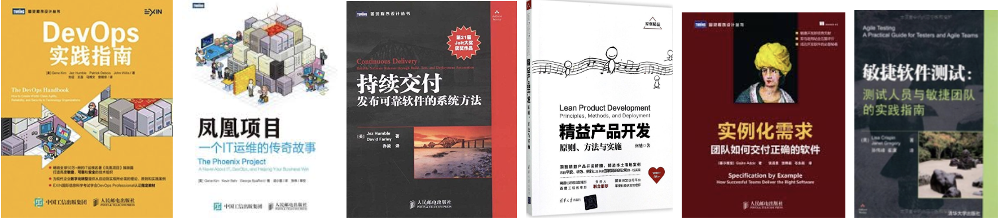

# awesome-devops

感谢 林伟丹 同学整理，我只负责搬砖

欢迎大家通过 [issue](https://github.com/agilechina/awesome-devops/issues/new) 或者 pull request 方式提交意见和修改。

本帖从网络及公开渠道上汇集了与DevOps有关的部分文章和资料，供学习用途。

## DevOps总览

new! [DevOps高效能组织的秘密](https://mp.weixin.qq.com/s/z-8LLgmo0i4vSpCdJHKNQA) #姚冬

[驱动力：高效能组织背后的DevOps 实践](https://mp.weixin.qq.com/s/BxL8PmFy3-mi4lxRl9E9eg)  #张乐

[成熟度模型已死--本文有争议，慎入！](https://mp.weixin.qq.com/s/7fdXj7YDOjqz0IQYvgowjg)  #刘征

[一文收录16张DevOps ”拍照神图”](https://mp.weixin.qq.com/s/wCFM6Ln-iG_G-Um8cad0aA)  #许峰

[DevOps道法术器2.0，让你一张图读懂DevOps](https://mp.weixin.qq.com/s/IbtTSsTvy2xkPG5COSorCA)  #张乐

[DevOps 会让你失业吗？](https://mp.weixin.qq.com/s/tD2A3zdB2O7xbJxIUu0UlQ)  #MjSeven（译）

[DevOps发展的9个趋势](https://mp.weixin.qq.com/s/EQsdKRDIevJD0W2xJD8EMA)  #顾宇

[敏捷、持续交付和三步法](https://mp.weixin.qq.com/s/HvD1WGiUKOwyR5f0QFXt_g)  #石建华

[实例化DevOps原则](https://mp.weixin.qq.com/s/I_aFeGdNM1sRXee6srxkeA)  #伍斌

[从集装箱历史看DevOps的发展进程](https://mp.weixin.qq.com/s/F9gdOmflzIlPvTaTMv6ytw)  #万金

## DevOps文化/转型

new! [跨越鸿沟：再析DevOps历程中的烟斗曲线](https://mp.weixin.qq.com/s/nPLnthk5_UJnE10BlbpfQg) #乔梁

new! [实施 DevOps 过程中的两个关键思考](https://mp.weixin.qq.com/s/sUQ5WlHe7reepZeNQ3h5hg) #乔梁

[传统金融行业如何挑战互联网](https://mp.weixin.qq.com/s/_48YA6rbrYZbIKpgeEO1-A) #徐磊

[畅销书《凤凰项目》之后 - 作者对DevOps的深度思考](https://mp.weixin.qq.com/s/HMuC2kVvP3Iq4FZqeHwjeg)  #许峰

[DevOps转型成功之路 - 误区、实践和实施路径](https://mp.weixin.qq.com/s/7rQB4RjXJB4F8fGwtj0agQ)  #张乐

[DevOps为什么这么“难”](https://mp.weixin.qq.com/s/qzLpGbEiPeiE5B4O-0gJHQ)  #许峰

[DevOps落地三部曲：如何归责？用啥工具？往哪里去？](https://mp.weixin.qq.com/s/_HscF-LeSVXpGF0BLvnYGg)  #任发科

[DevOps听起来不错，但适合你的企业么？](https://mp.weixin.qq.com/s/E8mxrU6_7cveq-4elL3rWw)  #张乐

[杀不死你的让你更坚强，反脆弱型研发组织构建](https://mp.weixin.qq.com/s/UuT8ojAKnSyf9af74jtpEQ)  #姚冬

## DevOps实践

new! [Accelerate：驱动效能改进的24个关键能力](https://mp.weixin.qq.com/s/4Vdc40sVcDKT-PIWt21UbA)  #林伟丹

new! [如何构建高效的持续交付能力](https://mp.weixin.qq.com/s/1OTtGq81J-uxfMspIOA7oA)  #姚冬

new! [书摘 | 发布模式与分支策略](https://mp.weixin.qq.com/s/Q3tUKUzuTtxIj1Ci2MFjqA)  #乔梁

new! [书摘 | 持续集成实践的自查表](https://mp.weixin.qq.com/s/WoYFJJlW6uVzzZBXPoB_JA)  #乔梁

[最早的“部署流水线”原来在这里](https://mp.weixin.qq.com/s/nAzgyIVGhX6uxBEggi6x7A)  #乔梁

[版本发布模式有几种？](https://mp.weixin.qq.com/s/1F-aTON05DSxfrOjXrcRXA)  #乔梁

[你从未见过的五个强大的DevOps指标](https://mp.weixin.qq.com/s/sNmr8ytgwFGlpQPJUQu8LQ)  #许峰

[当生存本能遇到VUCA，谈谈我们为什么需要DevOps流水线](https://mp.weixin.qq.com/s/Bd6ZjjrtKv4LQskVJ8qJMw)  #姚冬

[通过 DevOps 故事落地 DevOps 实践](https://www.jianshu.com/p/d2dff8e89280?utm_campaign=hugo&utm_medium=reader_share&utm_content=note&utm_source=weixin-timeline&from=timeline)  #顾宇

[DevOps持续交付快速指南](https://mp.weixin.qq.com/s/wiockNOeRz-aKB4NhuVSKw)  #Pam Baker

[漫谈微服务与DevOps：如何在实践中快速落地](https://mp.weixin.qq.com/s/-4qsTmncmVaRd0B72LnRwA)  #顾伟

[以终为始，再谈持续交付流水线](https://mp.weixin.qq.com/s/5I0h19SlmD776qB4pECIOQ)  #姚冬

[从熵增定律出发，谈谈演进式架构与技术债务](https://mp.weixin.qq.com/s/vSaCzn9y05TuS8VhxVB7yQ)  #姚冬

## DevOps国内案例

new! //百度PS团队持续交付案例-乔帮主系列文章

[【1】有的放矢最重要](https://mp.weixin.qq.com/s/4VCfHJaEiWwmg-rd3stdeg)  #乔梁

[【2】估算那点事儿，很简单](https://mp.weixin.qq.com/s/OlnWx_uFegvKqXfaBgTTMQ)  #乔梁

[【3】如何制定项目计划](https://mp.weixin.qq.com/s/jPVuRa67punLb-Na_VSt3g)  #乔梁

[【4】如何做好迭代活动管理？](https://mp.weixin.qq.com/s/7ootgk031LRBMeKeHcOQCw)  #乔梁

[【5】持续集成九问](https://mp.weixin.qq.com/s/q4ZFlzD52ul3_Rwll4O97w)  #乔梁

[【6】开发人员总是高估自己的能力](https://mp.weixin.qq.com/s/TF3l-qe0hNfFo4FLE9Hjbg)  #乔梁

[【7】建立部署流水线(pipeline)时，最先遇到的那些“坑儿”啊](https://mp.weixin.qq.com/s/5DSy-iFIYYlktyWlGdjJwg)  #乔梁

[【8】应用运维：为什么要排队上线？](https://mp.weixin.qq.com/s/aWurMKQPQLtXZahylp30OA)  #乔梁

[【9】发布速度提升六倍，运维同学怎么说？](https://mp.weixin.qq.com/s/4SqFa4vV5E8IwlBmJ84AkQ)  #乔梁

new! [京东数科DevOps落地攻略](https://mp.weixin.qq.com/s/XVzQMd-nWwdllqJj7P9SEQ)  #田晓旭

new! [美团点评运营配置平台的设计与实践之道](https://mp.weixin.qq.com/s/Ha9UKpbWiMHvAiacMsgR2Q)  #蒋国宝

new! [腾讯研发效率领先的秘密：高效率的工具](https://mp.weixin.qq.com/s/qy_hdiqzAVDxxyErcp1gpQ)  #腾讯技术工程

new! [GoCD 如此一个简洁漂亮的软件](https://mp.weixin.qq.com/s/6jwKoHCRu2AckOzqpCRn6w)  #孙磊

new! [工商银行DevOps进行时](https://www.douban.com/note/696842302/)  #老李

[Google的代码质量文化，花了5年时间](https://mp.weixin.qq.com/s/AxcdaP5imVULF7sGo_KhdQ)  #乔梁

[拉动端到端价值交付--平安Devops演进历程 ](https://mp.weixin.qq.com/s/xdd76MsW7GodnJgZoZ5KpA) #林伟丹

[博时基金 - DevOps重塑IT价值助力金融科技创新发展](https://mp.weixin.qq.com/s/RrCJyjxyP_Amfx3kYKJLpg)  #《金融电子化》

[华为DevCloud百人大规模精益DevOps转型实践](https://mp.weixin.qq.com/s/Trro8_9uMO00qo5PLUmtOQ)  #王明兰

[持续交付七巧板，从腾讯和百度的案例说起](https://mp.weixin.qq.com/s/wGJ-nKOJ9iDU15Yz0i5Xow)  #乔梁

[DevOps 三步工作法之持续反馈的技术与腾讯案例](https://mp.weixin.qq.com/s/a2UhaJjAcdKPsSfJUV95uA)  #梁定安

[实战：阿里巴巴 DevOps 转型后的运维平台建设](https://mp.weixin.qq.com/s/_np2d5aYm7_0awQ6xqwwGw)  #陈喻

[中兴会议电视X项目端到端案例](https://mp.weixin.qq.com/s/sCf0Fz4lkwISplrVbia3bA)  #李立世

[中兴某项目DevOps端到端实践](https://mp.weixin.qq.com/s/PCM2BZeDMdLStMgDPYRtlQ)  #尹成水

[猎豹基于亚马逊AWS的DevOps的实践指南](https://mp.weixin.qq.com/s/_2leWOld-doep-2NcUc7gw)  #代闻

## DevOps国外案例

[移动App发布后，质量成本高？看Esty如何应对发布质量](https://mp.weixin.qq.com/s/4MzGtMzuVK5b3yj65heM1w)  #乔梁

[开发人员写测试，Google是这样做到的，你想到没有](https://mp.weixin.qq.com/s/G9N4MH1csbwoGSTCSQg6EQ)  #乔梁

[某澳洲险企DevOps团队之殇](https://mp.weixin.qq.com/s/XMJyspySu3-XsYhL_nstMA)  #杜屹东

[DevOps登山指南 - 来自全美互惠保险公司的案例分析](https://mp.weixin.qq.com/s/kwsvF-mv3fwEBz4aV9YW9g)  #刘征

[大象翩翩起舞！国外大型银行DevOps转型干货总结](https://mp.weixin.qq.com/s/ECymqrJRlNMHfTk2HMyGMQ)  #张乐

[DevOps案例-Seek转型实战案例](https://mp.weixin.qq.com/s/yRngkMRT3G1TDCzZI_UZuA)  #刘征

[从企业案例看 DevOps 转型路线图](https://mp.weixin.qq.com/s/Tp8LZ9FFCwRr-YQ0QMnn4w)  #许峰

[金融行业DevOps转型案例：Capital One两年实现蝶变](https://mp.weixin.qq.com/s/q4BGTCLzbWjpVQryKzgExA)  #许峰

[传统零售企业的逆袭 | Target 与 DevOps 的美妙邂逅](https://mp.weixin.qq.com/s/oUIuA_x18DdMnw1nh1wjkQ)  #许峰

## DevOps国外案例（JFrog整理）

[谷歌的DevOps文化](https://mp.weixin.qq.com/s?__biz=MzIwMzc4NDY4Mw==&mid=2247484556&idx=1&sn=03dc41426388b2b0a8006930403c9b04&chksm=96cb6c08a1bce51ed5b8e1b8dd2c8aaffdac26bb00636ae5222dfb80d973bd170055d5793cc1&scene=21#wechat_redirect)  #王青

[每天发布1000次变更 - Netflix 的微服务实践和经验](https://mp.weixin.qq.com/s/wfOT4OPPgXwmkLAw6N4CqA)  #王青

[在甲骨文主导 DevOps 的变革是一种什么体验？](https://mp.weixin.qq.com/s/Ck3-Kh_BKESGiE0ChPqMog)  #王青

[思科的5人DevOps 团队是如何打造千万工件级别，5中心持续交付平台的？](https://mp.weixin.qq.com/s/pWoS_Oa5KRrTIgsabmfTpw)  #王青

[VMware 的持续交付平台](https://mp.weixin.qq.com/s/uJ5dLGH0TuySLq6_1DhxMQ)  #王青

[Uber:扩容到一千个微服务之前，你需要知道的事情](https://mp.weixin.qq.com/s/aorsFOEOJuaqslQlRTxPFg)  #王青

[构建，打包，部署速度加快5倍 - Adobe完成DevOps的华丽转型](https://mp.weixin.qq.com/s/XWTExKGIvETFxL4bYs4vGA)  #王青

[金融行业巨头 ING 如何搭建统一持续交付平台](https://mp.weixin.qq.com/s/VDSrxVyq5PS4ZmcrBB85cA)  #王青

[美国领先国防武器提供商雷神如何为传统应用提供统一的 CI/CD 流水线](https://mp.weixin.qq.com/s/VDSrxVyq5PS4ZmcrBB85cA)  #王青

[CA 搭建统一交付平台，实现快速发布](https://mp.weixin.qq.com/s/xy8xIeq99JXGiasiES1Ocw)  #王青

[传统 Java 网站如何实现容器化？看看 Cars.com 如何玩转 Docker！](https://mp.weixin.qq.com/s/PmOzIDJbsMmCCs96dF_b6w)  #王青

## 电子文档/胶片

百度云盘：[【共享】DevOps学习交流资料](https://pan.baidu.com/s/1udigtjvBf-R-6gejvboP8g)

## 推荐书籍
